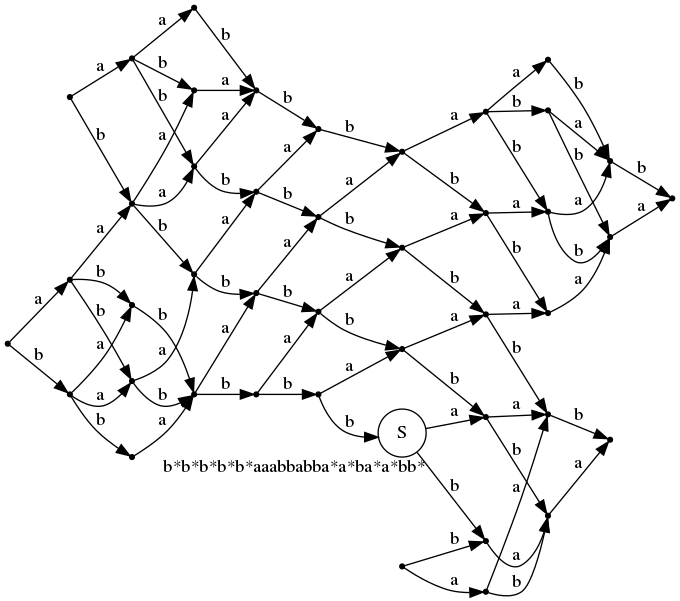

# Van Kampen diagramm generator

Tool for generating Van Kampen diagramms. Not all generated graphs are planar :(

## Usage

### Install graphviz

```bash
sudo apt-get install graphviz
sudo apt-get install graphviz-dev
```

### Build

```bash
mkdir build && cd build
make
```

### To generate .dot file

```bash
./build/van_kampen_diagramm GROUP_REPRESENTATION GRAPH_SIZE  > diagramm.dot
```

Where:

* GROUP_REPRESENTATION - string in format `<a, b, c, d | a*bc*d, ab*b*d, ab>`. All letters must be lowercase latin and `x*` states for inversed `x`.

* [optional] GRAPH_SIZE - generator iterations, 5 by default.

### To generate [format] file

```bash
dot -T[format] diagramm.dot -o outfile.[format]
```

Supported formats list can be found at [graphviz.org](https://graphviz.org/doc/info/output.html)

## Example

```bash
./build/van_kampen_diagramm "<a, b | aba*b*, ab*a*b>" 10 > build/diagramm.dot
dot -Tpng build/diagramm.dot -o outfile.png
```

Will generate Van Kampen diagramm for alphabet `ab` and following word.


