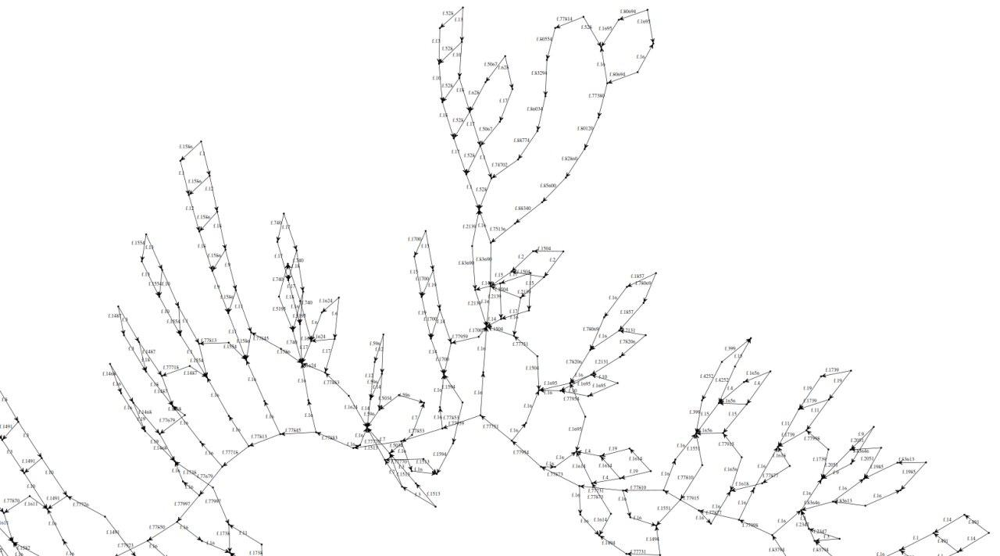

# Van Kampen diagram generator

Tool for generating Van Kampen diagramms.

## Usage

### Install graphviz

```bash
sudo apt-get install graphviz
sudo apt-get install graphviz-dev
```

### Clone this repository recursively

```bash
git clone https://github.com/Glebanister/van_kampen_diagramm --recursive
```

### Build

```bash
mkdir build && cd build
make
```

### Generate .dot file

```bash
./vankamp-vis -i <group-representation-path>
```

Will generate `vankamp-vis-out.dot`

Where `group-representation-path` - path to group representation file in a format corresponding to
[LangToGroup](https://github.com/YaccConstructor/LangToGroup)
format.

|        Option        | Param                                                                 | Argument type        |
|:--------------------:|:----------------------------------------------------------------------|----------------------|
|    `-i, --input`     | Specify input file                                                    | string               |
|    `-o, --output`    | Specify custom output file (default:  `<input-filename>-diagram.dot`) | string               |
| `-c, --cycle-output` | Set boundary cycle output file (default:    vankamp-vis-cycle.txt)    | string               |
|  `-n, --no-shuffle`  | Do not shuffle representation before generation                       | -                    |
|    `-q, --quiet`     | Do not log status to console                                          | -                    |
|    `-l, --limit`     | Set cells limit                                                       | non-negative integer |
|    `--per-large`     | Set the number of small words used to build one big one               | non-negative integer |
|    `--iterative`     | Build diagram with iterative algorithm (default:  true)               | -                    |
|   `--large-first`    | Build diagram with large-first algorithm                              | -                    |
|     `--merging`      | Build diagram with merging algorithm (not recommended)                | -                    |
|    `-s, --split`     | Split diagram in smaller components (default: false)                  | -                    |
|     `-h, --help`     | Print usage                                                           | -                    |

Group representation format example:

```bash
any text before representation
f := FreeGroup( "a", "b" );
g := f / [ a*b*(a)^(-1)*(b)^(-1), a*b*(a)^(-1)*(b)^(-1) ];
any text after representation
```

### Generate [format] file

```bash
dot -T[format] <your-diagram-path> -o outfile.[format]
```

### Generate svg file

```bash
./generate-svg.sh <file-with-diagram>
```

Supported formats list can be found at [graphviz.org](https://graphviz.org/doc/info/output.html)

## Example

```bash
$ head -c 40 out.txt
local f, g;
f := FreeGroup( "f.1", "f.2"
$ ./vankamp-vis -i out.txt
$ dot -Tsvg -O vankamp-vis-out.dot
```

Or by using `-s` flag to make it easier for graphviz

```bash
$ ./build/vankamp-vis -i diagrams/one/det/one-det -s -l 100
Total relations count: 7637
Hub size: 300
Relations used: 100%
$ ./generate-svg.sh diagrams/one/det/one-det-diagram/
$ ls diagrams/one/det/one-det-diagram/svg/
10.dot.svg
12.dot.svg
14.dot.svg
...
```

Will generate Van Kampen diagram for alphabet group representation in `out.txt` file.


